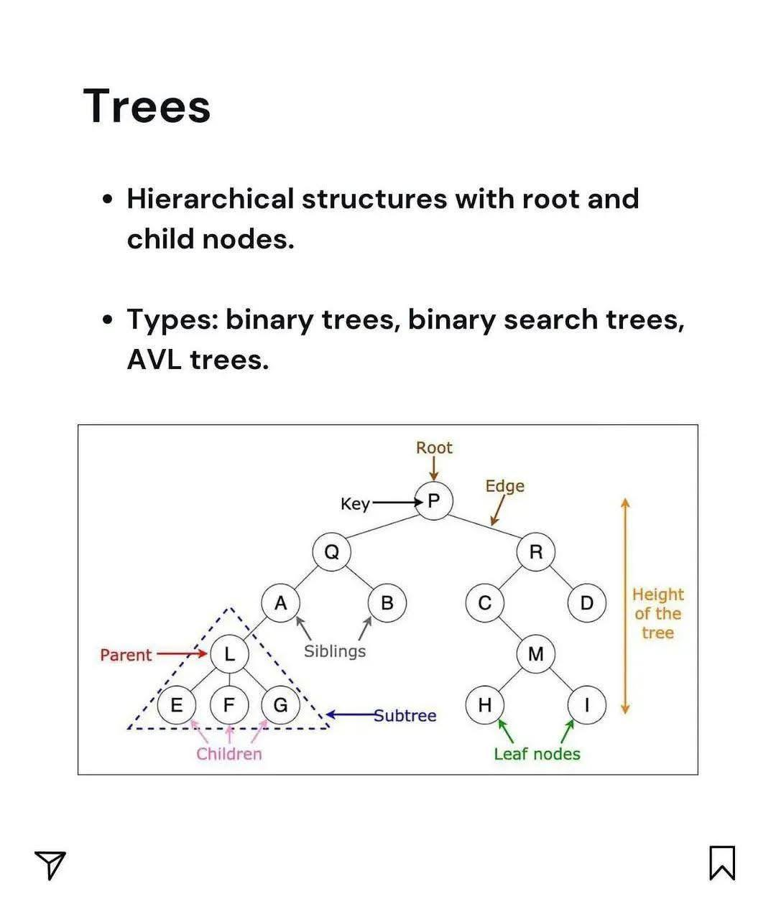
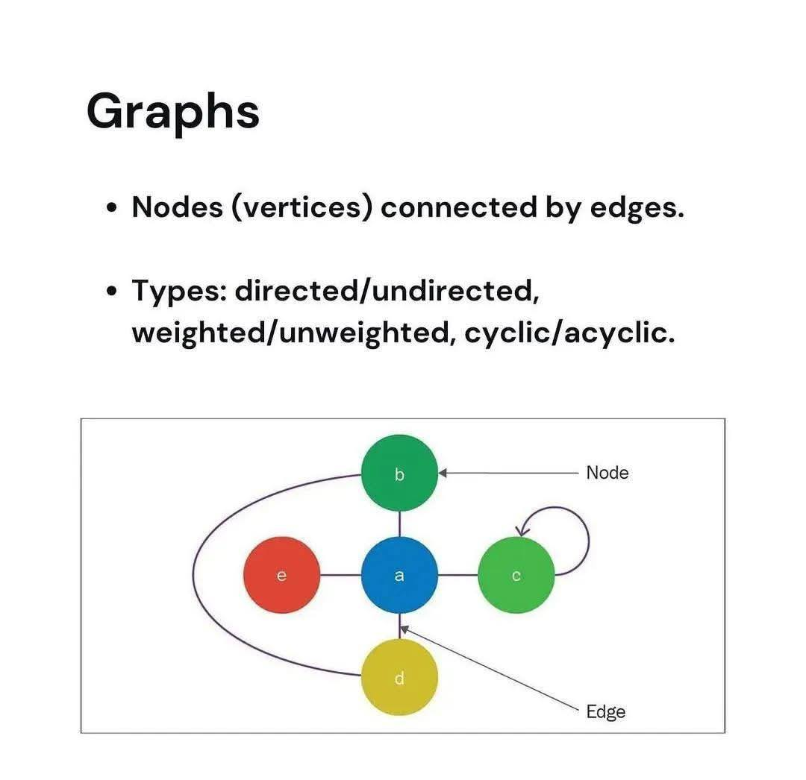
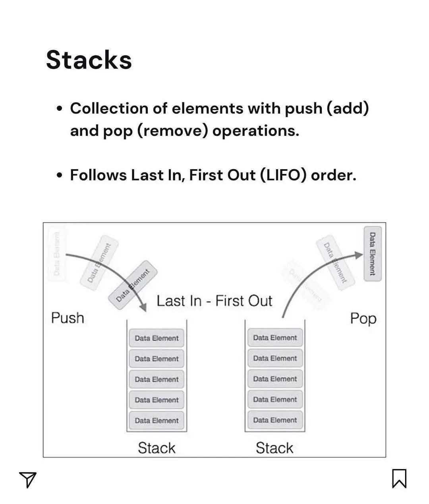
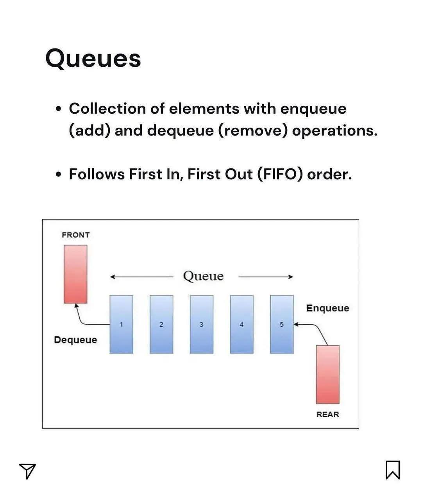
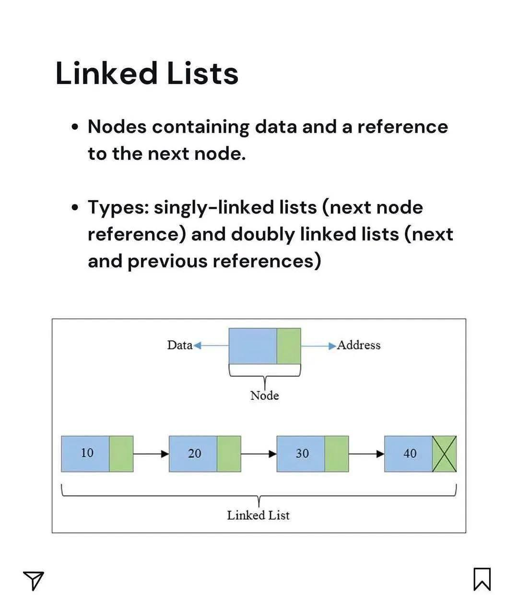
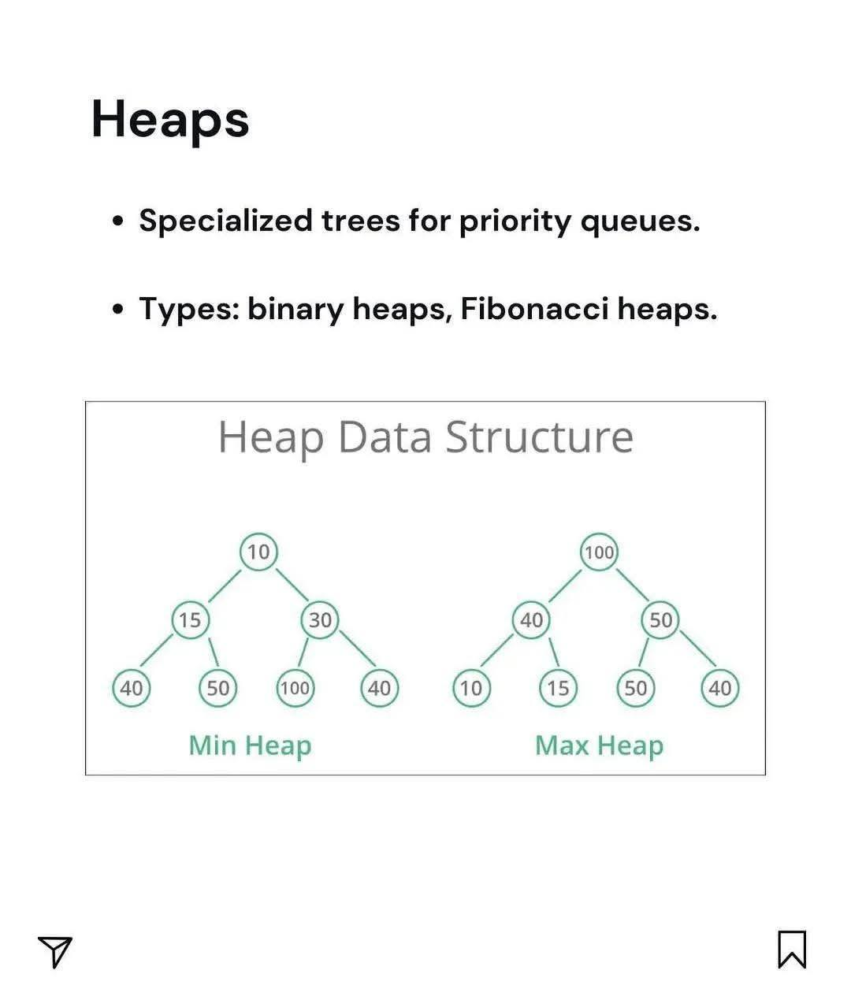

# **1. Trees** (Cây)

*Explain:*
>Cấu trúc phân cấp, gồm nút gốc (root) và các nút con (child). Ví dụ: cây thư mục.
---

# **2. Graphs** (Đồ thị)

*Explain:*
>Gồm đỉnh (vertex) và cạnh (edge), biểu diễn mối quan hệ phức tạp (mạng xã hội, bản đồ).

---

# **3. Stacks** (Ngăn xếp – LIFO)

*Explain:*
>Kiểu LIFO (Last In, First Out) – vào sau ra trước. Ví dụ: chồng sách.
---

# **4. Queues** (Hàng đợi – FIFO)

*Explain:*
>Kiểu FIFO (First In, First Out) – vào trước ra trước. Ví dụ: xếp hàng mua vé.
---

# **5. Linked Lists**

*Explain:*
>Dãy các node, mỗi node chứa dữ liệu và con trỏ tới node tiếp theo.
---

# **6. Heaps**

*Explain:*
>Cây nhị phân đặc biệt, thỏa mãn tính chất heap (node cha ≥ hoặc ≤ node con). Dùng cho priority queue.